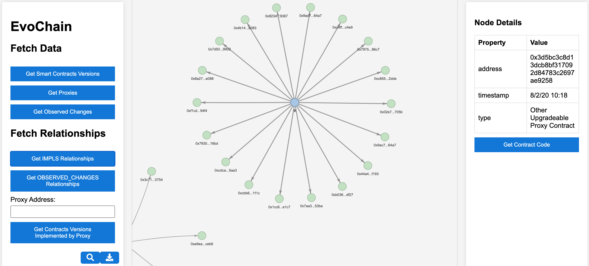

# EvoChain

EvoChain is a framework for tracking and visualizing the evolution of smart contracts. By combining a Neo4j graph database, a Flask API, and an intuitive user interface, EvoChain provides stakeholders with actionable insights into smart contract histories, upgrade paths, and vulnerabilities.

---

## Features

- **Interactive Visualizations**: Visualize smart contract versions and relationships.
- **Graph-based Database**: Tracks contract evolution using Neo4j.
- **API for Smart Contracts**: Retrieve and analyze smart contract data dynamically.
- **Real-Time Code Retrieval**: Fetch verified source code via Etherscan.

---

## EvoChain Architecture

EvoChain is built with a modular architecture comprising three layers:

1. **Data Layer**:
   - Stores smart contract data in a graph-based Neo4j database.
   - Aggregates data from EthereumETL and Etherscan APIs.

2. **API Layer**:
   - Built with Flask to serve as an intermediary between the data layer and UI.
   - Handles data querying, transformation, and retrieval.

3. **User Interface Layer**:
   - An interactive web application for exploring contract evolution and relationships.

Below is a snapshot of EvoChain's user interface:



---

## Requirements

- **Docker**: [Get Docker](https://docs.docker.com/get-docker/)
- **Docker Compose**: [Install Docker Compose](https://docs.docker.com/compose/install/)

---

## Installation and Setup

### Step 1: Clone the Repository

```bash
git clone https://github.com/IlhamQasse/EvoChain.git
cd EvoChain
```

### Step 2: Create the Neo4j Folder

1. Inside the root directory of the project (`EvoChain`), create a folder named `neo4j`:
   ```bash
   mkdir neo4j
   ```

2. Download the required Neo4j dump file from the following link:
   [Download Neo4j Dump](https://drive.google.com/file/d/12VaL4Wc0_29Ir3THeIQbY10yooGE_OgH/view?usp=sharing)

3. Place the downloaded `neo4j.dump` file inside the `neo4j/` folder.

   Final structure:
   ```plaintext
   EvoChain/
   ├── neo4j/
   │   └── neo4j.dump
   ├── app/
   ├── docker-compose.yml
   ├── Dockerfile
   ├── README.md
   ```

### Step 3: Start the Application

1. Build and start the Docker containers:

   ```bash
   docker-compose up --build
   ```

   This will:
   - Start Neo4j at `http://localhost:7474` (default credentials: `neo4j/123456789`).
   - Start the Flask application at `http://localhost:5000`.

2. Stop the application when you're done:

   ```bash
   docker-compose down
   ```

---

## Using EvoChain

### User Interface Features

- **Graph Visualizations**: Display smart contract relationships.
- **Fetch Data**: Use the UI buttons to retrieve contract versions, proxies, and root causes.
- **Query Relationships**: Analyze contract-to-proxy and implementation relationships.
- **Node Details**: View detailed contract metadata, including contract address, timestamps, and type.

---

## Folder Structure

```plaintext
.
├── app/                  # Contains Flask backend code, templates (HTML), and logic
├── neo4j/                # Neo4j database configuration and data (place `neo4j.dump` here)
├── docker-compose.yml    # Docker Compose configuration
├── Dockerfile            # Dockerfile for Flask app
├── README.md             # Project README
```

---

## Citation

If you use EvoChain in your research or projects, please cite our work:

```bibtex
@inproceedings{EvoChain2024,
  author    = {Ilham Qasse and Mohammad Hamdaqa and Björn Þór Jónsson},
  title     = {EvoChain: A Framework for Tracking and Visualizing Smart Contract Evolution},
  year      = {2024}
}
```
